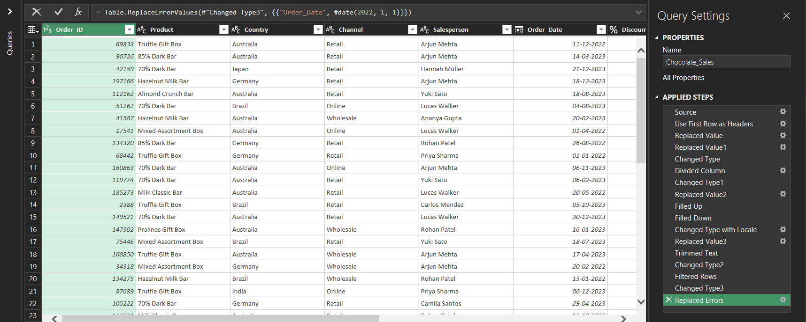
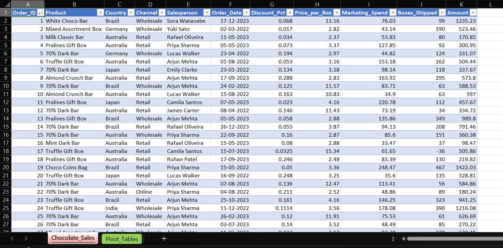
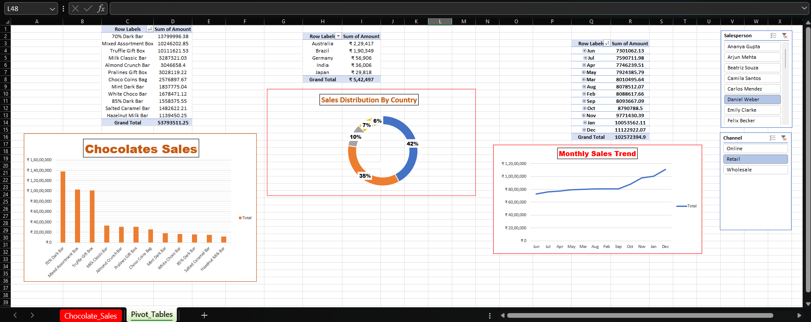
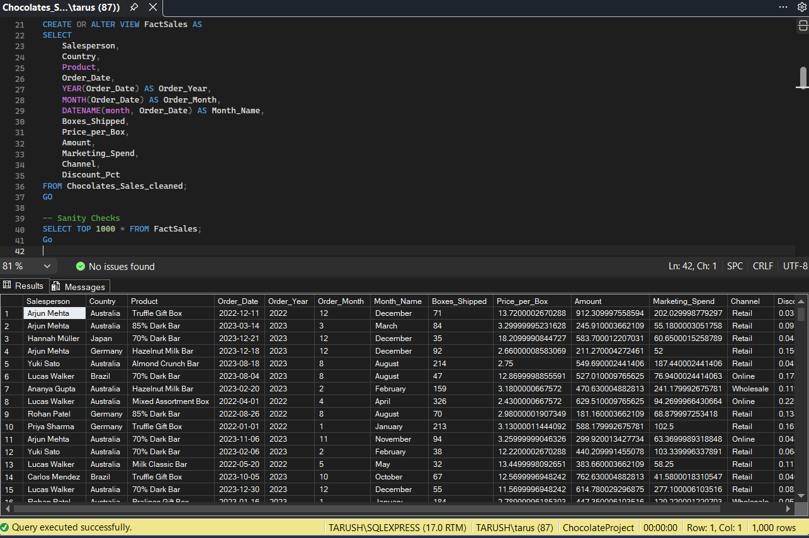
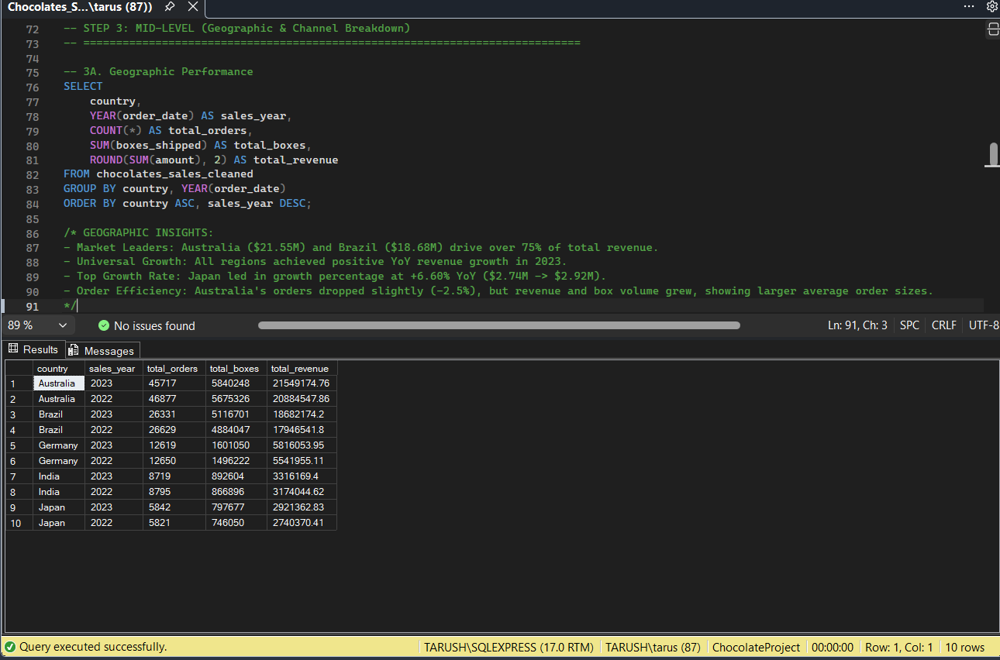
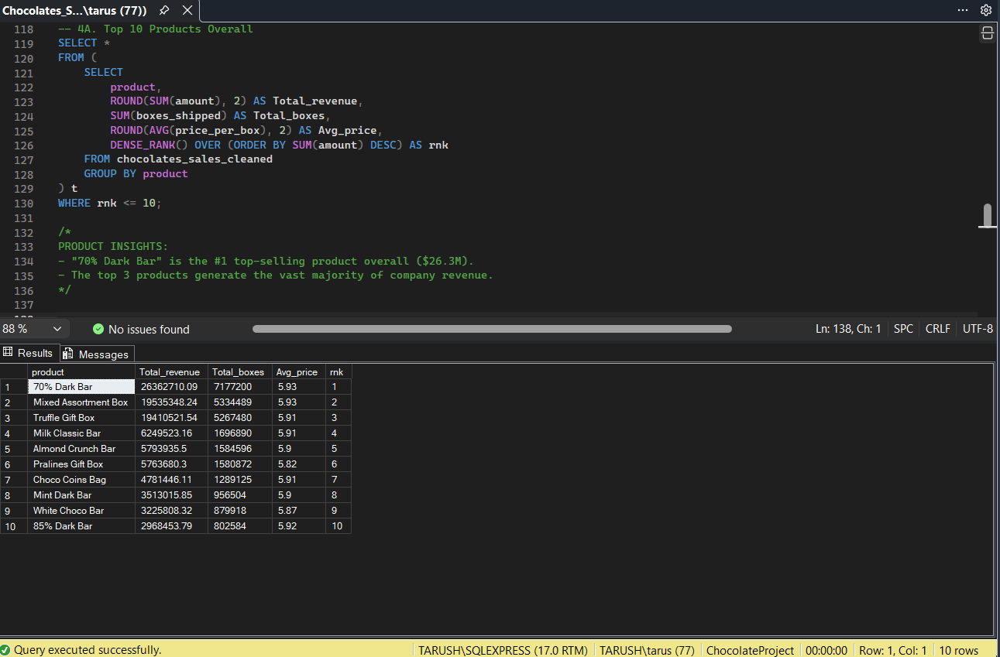
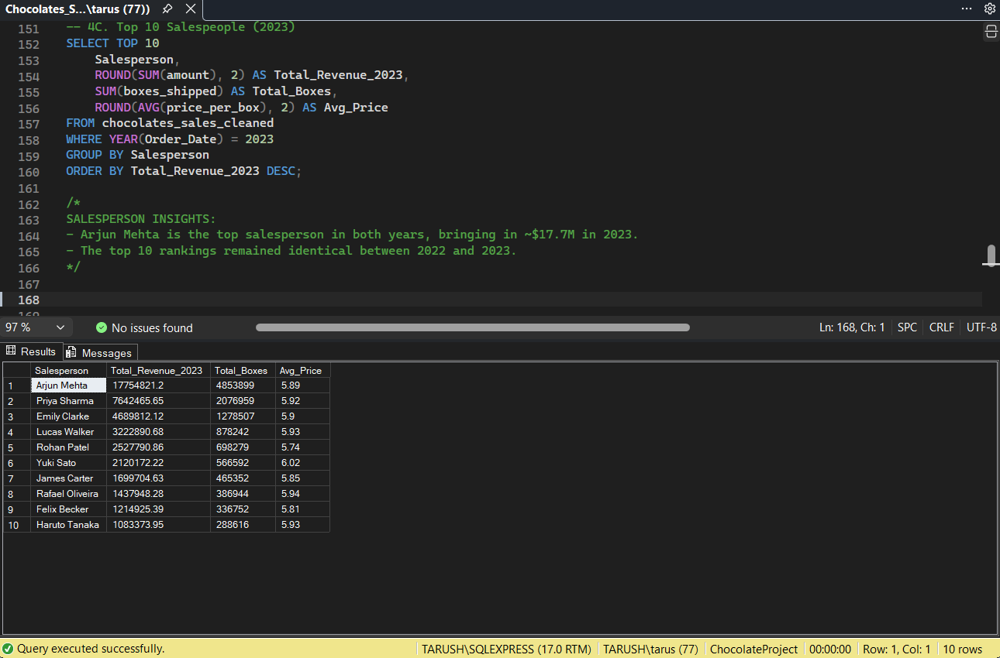
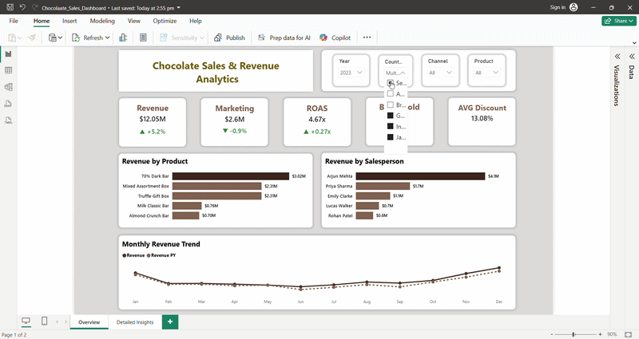
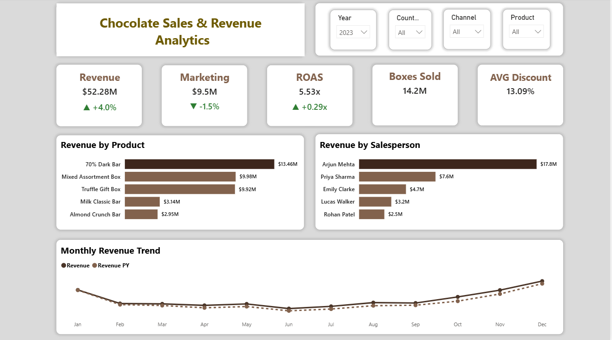
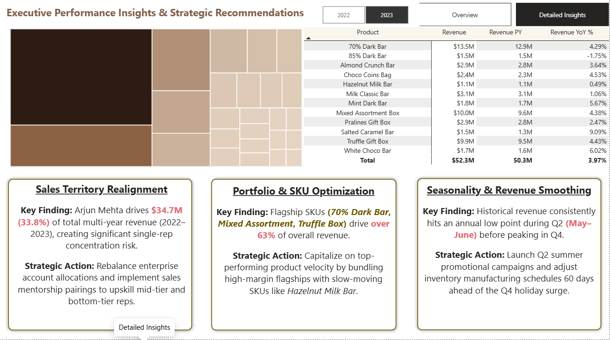

# chocolate-sales-analytics
End-to-end sales analytics pipeline built using Excel (Power Query & Pivot Tables) for data cleaning and exploratory analysis, SQL for querying aggregations, and an interactive Power BI dashboard featuring DAX measures and Star Schema data modeling.
---

 ➔  ➔ 

# 🍫 Chocolate Sales & Revenue Analytics

## 📊 Executive Summary
An end-to-end data analytics project evaluating enterprise revenue performance, product portfolio efficiency, seasonal trends, and salesforce concentration dynamics across global channels.

By integrating cross-functional datasets across Excel, SQL, and Power BI, this analysis identifies flagship revenue drivers (e.g., *70% Dark Chocolate Bar*), pinpoints slow-moving product lines, exposes a pronounced Q4 seasonal demand surge, and uncovers high salesperson concentration risk. The findings provide actionable strategic recommendations for sales territory realignment, portfolio bundling, and revenue smoothing.

---

## ❓ Key Business Questions
* **Product Classification:** Which flagship products act as "Cash Cows" for enterprise revenue, and which slow-moving "Zombie SKUs" require promotional bundling or restructuring?
* **Salesforce Performance:** How is sales performance distributed across the team, and which underperforming sales staff need territory realignment or mentorship?
* **Seasonality Trends:** Does historical sales data indicate a predictable Q4 seasonal demand surge, and how should inventory be managed ahead of it?
* **Pricing & Discounting:** Did offering higher average discounts in 2023 directly drive higher unit volumes and top-line sales performance?

## 🛠️ Data Pipeline & Technical Architecture

### 1. Data Cleaning & Exploratory Analysis (Microsoft Excel)
* **Data Auditing & Cleaning:** Extracted raw datasets, resolved and handled missing values across **700+ cells**, adjusted data types, and standardized date formats using **Power Query**.
* **Exploratory Data Analysis (EDA):** Built dynamic **Pivot Tables** and integrated **Slicers** for interactive cross-filtering, quick spot-checking, revenue aggregation, and rapid preliminary insights.

#### 🔍 Excel Data Pipeline Visuals

**Power Query ETL Steps:**

**Cleaned & Formatted Excel Table:**

**Excel Pivot Tables & EDA Dashboard:**

### 2. Relational Querying & Data Validation (SSMS / Microsoft SQL Server)
* **Database Views (`CREATE VIEW`):** Constructed reusable SQL Views to abstract aggregated queries and serve as clean, optimized data source layers for Power BI ingestion.
* **Query Aggregation & Auditing:** Formulated targeted SQL queries using core aggregate functions (`SUM`, `AVG`, `COUNT`) and `GROUP BY` clauses to validate baseline metrics prior to reporting.
* **Advanced Window Functions:** Executed analytical window functions (`DENSE_RANK() OVER ORDER BY`) to evaluate product velocity, rank top revenue drivers, and handle potential ranking ties.

#### 🗄️ SQL Server Execution & Query Visuals

**1. Infrastructure & View Setup (`FactSales`):**

**2. Geographic Breakdown & Aggregations (Mid-Level Analytics):**

**3. Product Rankings (Advanced Window Functions - `DENSE_RANK` Subquery):**

**4. Sales Representative Leaderboards (Top-N Filtering - `TOP 10`):**

### 3. Data Modeling & Interactive Visuals (Power BI)
* **Data Modeling:** Designed an optimized **Star Schema** establishing clean fact-dimension relationships across sales performance, product catalogs, sales representatives, and time dimensions.
* **DAX Formulas & Measures:** Formulated explicit DAX measures for executive KPIs including Total Revenue ($52.3M, +4.0% YoY), Marketing Spend ($9.5M), ROAS (5.53x, +0.29x YoY), Volume Sold (14.2M Boxes), and Average Discount Rate (13.09%).
* **Multi-Page Executive Dashboard Design:** Built an interactive, 2-page report styled with a warm, custom chocolate/espresso palette:
  * **Page 1 (Overview Dashboard):** Feature-packed executive overview featuring dynamic slicers (Year, Country, Channel, Product), key KPI card banners, top revenue drivers by product and salesperson, and interactive monthly trend comparisons (`Revenue` vs. `Revenue PY`).
  * **Page 2 (Executive Insights & Recommendations):** Integrated interactive treemaps, product-level YoY growth tables, and dedicated executive callout cards providing actionable business recommendations across **Sales Territory Realignment**, **Portfolio & SKU Optimization**, and **Seasonality & Revenue Smoothing**.

## 📊 Dashboard Preview

### 🔄 Interactive Walkthrough

---
### Executive Overview

### Performance Insights & Strategic Recommendations

## 💡 Key Business Insights

* **Portfolio & SKU Optimization (Cash Cows vs. Zombie SKUs):** Flagship "Cash Cow" SKUs (*70% Dark Bar*, *Mixed Assortment*, and *Truffle Gift Box*) drive over **63% of total revenue** ($33.4M), while slow-moving "Zombie SKUs" like *Hazelnut Milk Bar* ($1.1M) lag behind, presenting prime targets for promotional bundling.
* **Sales Territory & Concentration Risk:** Lead rep *Arjun Mehta* generated **$17.8M in 2023** ($34.7M multi-year, accounting for 33.8% of total enterprise sales), exposing severe single-agent concentration risk while highlighting underperformance across bottom-tier reps.
* **Seasonality & Demand Smoothing:** Historical monthly revenue trends consistently drop to annual lows during **Q2 (May–June)** before experiencing a sharp **Q4 demand surge**, signaling a need for pre-Q4 inventory adjustments and Q2 promotional campaigns.
* **Marketing & Volume Execution:** Promotional strategies achieved an overall **5.53x ROAS** (+0.29x YoY) across $9.5M in ad spend, pushing total box volume to **14.2M units** with an average discount rate of 13.09%.

---
> ### 📜 Copyright & Portfolio Disclaimer
> **© 2026 Tarush Nandan. All rights reserved.**
> 
> This repository, including its documentation, SQL queries, dashboard layouts, and visual architecture, is part of my personal data analytics portfolio for demonstration purposes only. Unauthorized copying, redistribution, or reuse of any assets within this project without explicit written permission is strictly prohibited.

---

## 📜 License

This project is protected under the terms of the [`LICENSE`](./LICENSE) file. Viewing and reviewing code for assessment is permitted, but full reproduction or commercial reuse is restricted.

